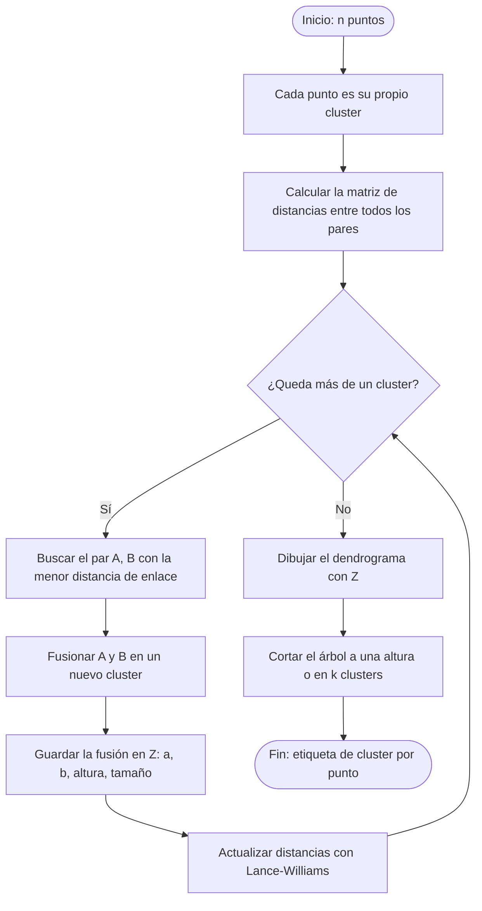
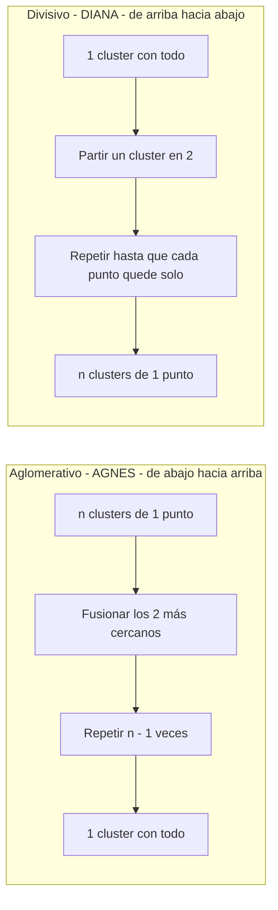
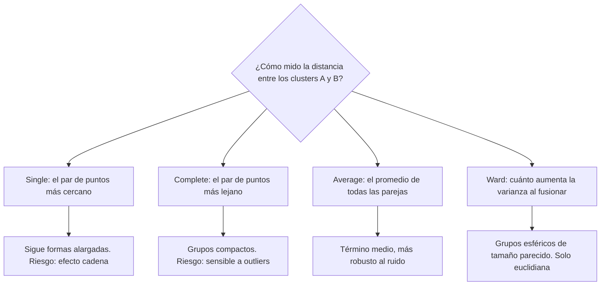
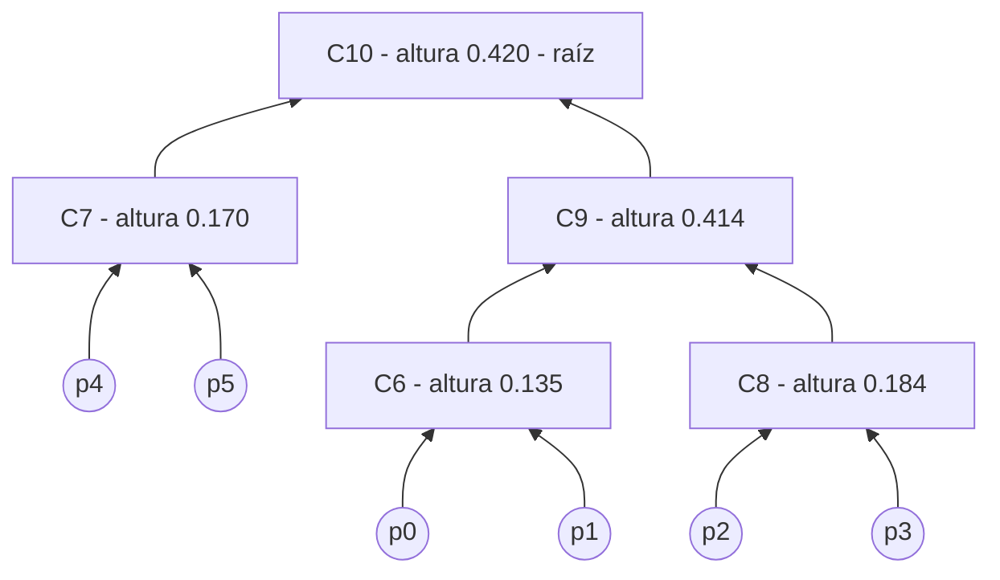
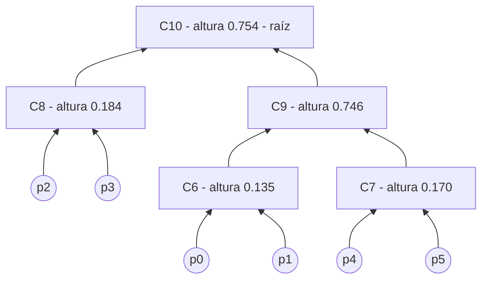
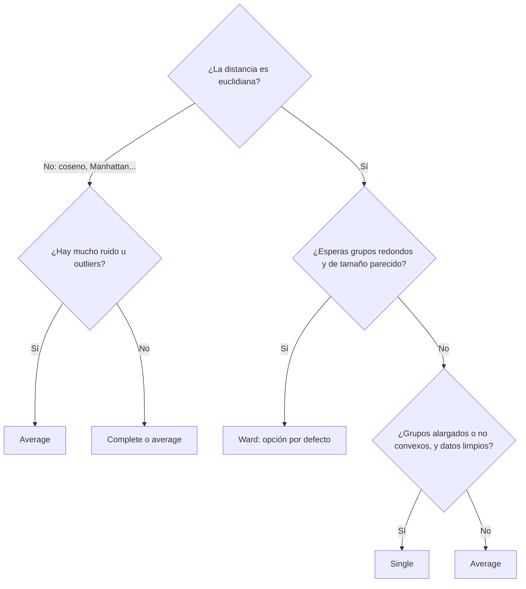
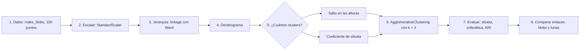

# Diagramas en Mermaid

Código Mermaid de los diagramas de la práctica. Cada bloque está pensado para **importarse en Excalidraw** y retocarse a mano. El pseudocódigo de referencia está en [`pseudocodigo.md`](pseudocodigo.md).

## Cómo importarlos en Excalidraw

1. Abre [excalidraw.com](https://excalidraw.com).
2. En la barra de herramientas, abre **Más herramientas** (el icono de la caja de herramientas) y elige **Mermaid a Excalidraw**.
3. Pega el código de un bloque (sin las líneas de apertura y cierre con tres acentos graves) y pulsa **Insertar**.
4. Ajusta la posición, los colores y los textos a tu gusto.
5. Exporta dos archivos con el nombre sugerido en cada diagrama y guárdalos en [`diagramas/`](diagramas/):
   - `.excalidraw`: el archivo editable;
   - `.png` o `.svg`: la imagen para el README y las diapositivas.

> Todos los diagramas son de tipo `flowchart`, porque es el único tipo que Excalidraw convierte en formas editables. Otros tipos, como `timeline`, se insertan como una imagen fija.

## Contenido

| # | Diagrama | Archivo sugerido |
|---|---|---|
| 1 | [Algoritmo aglomerativo](#1-algoritmo-aglomerativo) | `01-algoritmo` |
| 2 | [Aglomerativo vs. divisivo](#2-aglomerativo-vs-divisivo) | `02-aglomerativo-vs-divisivo` |
| 3 | [Criterios de enlace](#3-criterios-de-enlace) | `03-criterios-de-enlace` |
| 4 | [Dendrograma del ejemplo: single](#4-dendrograma-del-ejemplo-single) | `04-dendrograma-single` |
| 5 | [Dendrograma del ejemplo: Ward](#5-dendrograma-del-ejemplo-ward) | `05-dendrograma-ward` |
| 6 | [¿Qué enlace elegir?](#6-qué-enlace-elegir) | `06-elegir-enlace` |
| 7 | [Flujo de la práctica](#7-flujo-de-la-práctica) | `07-flujo-practica` |
| 8 | [Línea de tiempo](#8-línea-de-tiempo) | `08-linea-de-tiempo` |

---

## 1. Algoritmo aglomerativo

Corresponde a la sección 2 de [`pseudocodigo.md`](pseudocodigo.md#2-algoritmo-aglomerativo-versión-básica).

---

## 2. Aglomerativo vs. divisivo

---

## 3. Criterios de enlace

Corresponde a la sección 3 de [`pseudocodigo.md`](pseudocodigo.md#3-distancia-entre-clusters-criterios-de-enlace).

---

## 4. Dendrograma del ejemplo: single

Los 6 puntos de la sección 6 de [`pseudocodigo.md`](pseudocodigo.md#6-ejemplo-a-mano-con-6-puntos). Las flechas van de cada cluster hacia el cluster que lo contiene, y el número indica la altura de la fusión.

---

## 5. Dendrograma del ejemplo: Ward

Mismos 6 puntos. Los tres primeros pasos coinciden con single; en el paso 4 Ward une `C6` con `C7`, no con `C8`.

---

## 6. ¿Qué enlace elegir?

Guía rápida, no una regla absoluta. Siempre conviene comparar varios.

---

## 7. Flujo de la práctica

Corresponde a la sección 7 de [`pseudocodigo.md`](pseudocodigo.md#7-flujo-de-la-práctica) y al notebook [`clustering_jerarquico.ipynb`](../notebooks/clustering_jerarquico.ipynb).

---

## 8. Línea de tiempo

Autores y aportes principales.

```mermaid
flowchart LR
    T1["1948 - Sørensen: enlace complete"] --> T2["1951 - Florek y otros: enlace single"]
    T2 --> T3["1958 - Sokal y Michener: UPGMA, average"]
    T3 --> T4["1963 - Sokal y Sneath: Numerical Taxonomy"]
    T4 --> T5["1963 - Ward: mínima varianza"]
    T5 --> T6["1967 - Lance y Williams: fórmula unificada"]
    T6 --> T7["1967 - Johnson: dendrogramas y ultramétricas"]
    T7 --> T8["1973 - Sibson: SLINK en O de n cuadrado"]
    T8 --> T9["1990 - Kaufman y Rousseeuw: AGNES y DIANA"]
    T9 --> T10["2013 - Campello y otros: HDBSCAN"]
```

